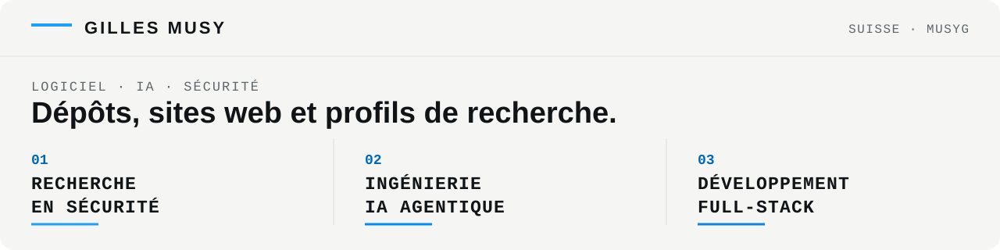

[English](./README.md) · **Français**

<picture>
  <source media="(prefers-color-scheme: dark) and (max-width: 820px)" srcset="./assets/profile-header-fr-mobile-dark.svg">
  <source media="(prefers-color-scheme: light) and (max-width: 820px)" srcset="./assets/profile-header-fr-mobile-light.svg">
  <source media="(prefers-color-scheme: dark) and (max-width: 1230px)" srcset="./assets/profile-header-fr-tablet-dark.svg">
  <source media="(prefers-color-scheme: light) and (max-width: 1230px)" srcset="./assets/profile-header-fr-tablet-light.svg">
  <source media="(prefers-color-scheme: dark)" srcset="./assets/profile-header-fr-dark.svg">
  <source media="(prefers-color-scheme: light)" srcset="./assets/profile-header-fr-light.svg">
  
</picture>

# Chercheur en sécurité · Ingénieur IA · Développeur full-stack

Basé en Suisse.

---

## Projet full-stack phare

### Celo Credentials

[celo-credentials-dapp](https://github.com/Musyg/celo-credentials-dapp) est une application de référence complète permettant d’émettre sur Celo des attestations de formation non transférables sans frais pour leur bénéficiaire. Les établissements signent des autorisations EIP-712 hors chaîne, un service de relais prend en charge les frais et les attestations restent vérifiables et révocables publiquement sur la blockchain.

- **Sur la blockchain :** contrat vérifié sur Celo Sepolia, avec transactions et attestations d’exemple publiques
- **Application :** Solidity, Foundry, Express, PostgreSQL, Next.js, wagmi, viem et TypeScript
- **Conception de la sécurité :** émetteurs autorisés, protection contre le rejeu et l’expiration, non-transférabilité, révocation, fuzzing et 8 tests Foundry réussis sur 8

_Implémentation de référence publique sur testnet ; elle n’a pas fait l’objet d’un audit indépendant pour un usage en production._

---

## Recherche en sécurité

Recherche sur les failles touchant les applications web, les smart contracts et les systèmes d’IA. Les constats publiés sont accompagnés de preuves reproductibles et d’un impact documenté.

**Domaines**
- Sécurité web et applicative : API, contrôle d’accès, logique métier et intégrations
- Smart contracts : Solidity / Vyper, preuves de concept sur forks avec Foundry et vérification formelle
- ZK et cryptographie appliquée : circuits, vérificateurs et systèmes de preuve
- Sécurité de l’IA et des agents : injection indirecte de prompts, usage abusif d’outils, chaînes d’attaque sur systèmes agentiques et évaluation adversariale

**Réalisations vérifiables**
- [security-reviews](https://github.com/Musyg/security-reviews), un catalogue d’audits reproductibles avec un dépôt par classe de vulnérabilité. Chaque dépôt comprend une cible vulnérable, une preuve de concept d’exploitation, une branche corrigée et un rapport, le tout validé par CI.
- [erc4626-inflation-audit](https://github.com/Musyg/erc4626-inflation-audit). Inflation des parts ERC-4626 lors du premier dépôt.
- [eip712-signature-replay-audit](https://github.com/Musyg/eip712-signature-replay-audit). Malléabilité de signature ECDSA permettant une double dépense.
- [reward-accounting-drift-audit](https://github.com/Musyg/reward-accounting-drift-audit). Dérive de comptabilisation des récompenses de type MasterChef.
- [stvault-audit](https://github.com/Musyg/stvault-audit). Vault de prêt : données d’oracle obsolètes, réentrance entre fonctions et arrondi des frais.
- [vyper-access-control-audit](https://github.com/Musyg/vyper-access-control-audit). Vault Vyper : transfert de propriété non protégé.
- [circom-underconstrained-audit](https://github.com/Musyg/circom-underconstrained-audit). ZK : circuit Circom sous-contraint rompant la propriété de solidité de Groth16.
- [formal-verification-overflow-audit](https://github.com/Musyg/formal-verification-overflow-audit). Vérification formelle : débordement dans le calcul d’une moyenne, hypothèse d’abord réfutée puis prouvée avec Halmos.

**Profils professionnels en sécurité**
- Gray Swan Arena : [GilMu](https://app.grayswan.ai/arena/user/6a3043c8221a153764c96ab5) (recherche sur l’injection indirecte de prompts et évaluation adversariale de systèmes d’IA)
- HackerOne : [@gilmu](https://hackerone.com/gilmu) (remerciement public du Secrétariat du Conseil du Trésor du Canada)
- Cantina : [@GilMu](https://cantina.xyz/u/GilMu)
- Code4rena : [@GiMu84](https://code4rena.com/@GiMu84)

---

## Ingénierie backend et infrastructure

Services Python et infrastructure, avec un accent sur l’exécution asynchrone, la gestion des pannes et l’observabilité.

- [production-agent-template](https://github.com/Musyg/production-agent-template). Gabarit de service FastAPI pour agents : cycle de vie asynchrone, endpoints de santé et de supervision, registre de circuit breakers, fonctions de récupération définies par l’application, métriques Prometheus, boucle d’arrière-plan optionnelle et script de génération.
- [agent-resilience](https://github.com/Musyg/agent-resilience). Circuit breaker, DLQ adossée à Redis et tampon MQTT hors ligne.
- [async-api-client](https://github.com/Musyg/async-api-client). Client REST asynchrone résilient : limitation de débit, nouvelles tentatives et pagination.
- [agent-self-healing](https://github.com/Musyg/agent-self-healing). Surveillance des dépendances avec états en ligne, dégradé et en erreur, ainsi que récupération automatique.
- [agent-metrics](https://github.com/Musyg/agent-metrics). Compteurs, jauges et histogrammes sans dépendance externe, exposés au format texte de Prometheus.
- [infra-reference](https://github.com/Musyg/infra-reference). Référence d’ingénierie de plateforme expurgée des données sensibles : Ansible multi-architecture, systemd renforcé, builds distroless, réseau maillé et observabilité.

_Missions : API backend, intégrations, observabilité et CI._

---

## IA et systèmes agentiques

Systèmes multi-agents, orchestration de modèles locaux et pipelines automatisés de construction et de revue, déployés sur une petite flotte de machines.

- [talos](https://github.com/Musyg/talos). Plateforme agentique distribuée : environ 55 agents et plus de 85 services sur une flotte de quatre nœuds, architecture mémoire à quatre composantes, assistant vocal et conversationnel en temps réel, et pipelines de construction automatisés.
- [multi-agent-orchestrator](https://github.com/Musyg/multi-agent-orchestrator). Modèle de routage des tâches fondé sur les capacités.

**Stack** : Python asynchrone par conception · exploitation de modèles locaux (llama.cpp / GGUF, routage de modèles, bascule à chaud optimisée selon la VRAM) · orchestration multi-agent · mémoire graph-RAG · recherche vectorielle · bus d’événements MQTT · voix en temps réel · Prometheus / VictoriaMetrics · systemd · CI (ruff, pytest, pre-commit).

---

## Ma méthode

Je privilégie les exemples reproductibles, les mesures pertinentes et les tests sur le système en fonctionnement.

## Développement web

- [inaricom.com](https://inaricom.com) : développement du site web et du backend.
- [Étude de cas Mika's Shop](./case-studies/fr/mikasshop.md) : conception et réalisation complète de la boutique Shopify ([voir la boutique](https://mikasshop.com)).
- [Étude de cas Pedi-Sense](./case-studies/fr/pedi-sense.md) : conception et réalisation complète de la boutique Shopify ([voir la boutique](https://pedi-sense.com)).
