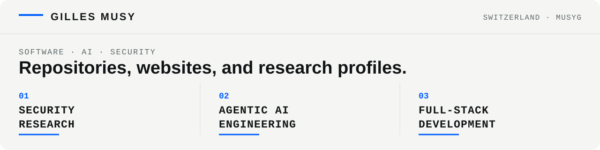

**English** · [Français](./README.fr.md)

<picture>
  <source media="(prefers-color-scheme: dark) and (max-width: 820px)" srcset="./assets/profile-header-mobile-dark.svg">
  <source media="(prefers-color-scheme: light) and (max-width: 820px)" srcset="./assets/profile-header-mobile-light.svg">
  <source media="(prefers-color-scheme: dark) and (max-width: 1230px)" srcset="./assets/profile-header-tablet-dark.svg">
  <source media="(prefers-color-scheme: light) and (max-width: 1230px)" srcset="./assets/profile-header-tablet-light.svg">
  <source media="(prefers-color-scheme: dark)" srcset="./assets/profile-header-dark.svg">
  <source media="(prefers-color-scheme: light)" srcset="./assets/profile-header-light.svg">
  
</picture>

# Security Researcher · AI Engineer · Full-Stack Developer

Based in Switzerland.

---

## Selected Full-Stack System

### Celo Credentials

[celo-credentials-dapp](https://github.com/Musyg/celo-credentials-dapp) is a full-stack reference application for gasless, non-transferable education credentials on Celo. Institutions sign EIP-712 vouchers off-chain, a relayer pays the gas, and credentials remain publicly verifiable and revocable on-chain.

- **On-chain:** verified Celo Sepolia contract with public sample transactions and credentials
- **Application:** Solidity, Foundry, Express, PostgreSQL, Next.js, wagmi, viem, and TypeScript
- **Security design:** authorized issuers, replay and expiry protection, non-transferability, revocation, fuzz testing, and 8/8 Foundry tests

_Public testnet reference implementation; not audited for production use._

---

## Security Research

Security research on web applications, smart contracts, and AI systems. Published findings include reproducible evidence and a documented impact.

**Focus**
- Web and application security: web applications, APIs, access control, business logic, and integrations
- Smart contracts: Solidity / Vyper, Foundry fork PoCs, formal verification
- ZK & applied cryptography: circuits, verifiers, proof systems
- AI and agent security: indirect prompt injection, tool misuse, agentic attack paths, and adversarial evaluation

**Proof of work**
- [security-reviews](https://github.com/Musyg/security-reviews), a catalogue of reproducible reviews, one repo per vulnerability class. Each ships a vulnerable target, an exploit PoC, a remediated branch, and a report, all green under CI.
- [erc4626-inflation-audit](https://github.com/Musyg/erc4626-inflation-audit). ERC-4626 first-deposit share inflation.
- [eip712-signature-replay-audit](https://github.com/Musyg/eip712-signature-replay-audit). ECDSA signature malleability double-spend.
- [reward-accounting-drift-audit](https://github.com/Musyg/reward-accounting-drift-audit). MasterChef-style reward accounting drift.
- [stvault-audit](https://github.com/Musyg/stvault-audit). Lending vault: oracle staleness, cross-function reentrancy, fee rounding.
- [vyper-access-control-audit](https://github.com/Musyg/vyper-access-control-audit). Vyper vault: unguarded ownership transfer (access control).
- [circom-underconstrained-audit](https://github.com/Musyg/circom-underconstrained-audit). ZK: under-constrained Circom circuit, Groth16 soundness break.
- [formal-verification-overflow-audit](https://github.com/Musyg/formal-verification-overflow-audit). Formal verification: averaging overflow refuted then proved with Halmos.

**Professional security profiles**
- Gray Swan Arena: [GilMu](https://app.grayswan.ai/arena/user/6a3043c8221a153764c96ab5) (indirect prompt injection research and adversarial AI evaluation)
- HackerOne: [@gilmu](https://hackerone.com/gilmu) (public acknowledgement from the Treasury Board of Canada Secretariat)
- Cantina: [@GilMu](https://cantina.xyz/u/GilMu)
- Code4rena: [@GiMu84](https://code4rena.com/@GiMu84)

---

## Backend & Infrastructure Engineering

Python services and infrastructure work focused on asynchronous execution, fault handling, and observability.

- [production-agent-template](https://github.com/Musyg/production-agent-template). FastAPI agent service template: async lifespan, health and dashboard endpoints, circuit breaker registry, application-defined recovery hooks, Prometheus metrics, optional background loop, and scaffolding.
- [agent-resilience](https://github.com/Musyg/agent-resilience). Circuit breaker, Redis-backed DLQ, offline MQTT buffer.
- [async-api-client](https://github.com/Musyg/async-api-client). Resilient async REST client: rate limiting, retries, pagination.
- [agent-self-healing](https://github.com/Musyg/agent-self-healing). Dependency health monitor with online/degraded/error states and auto-recovery.
- [agent-metrics](https://github.com/Musyg/agent-metrics). Dependency-free counters, gauges, histograms with Prometheus text exposition.
- [infra-reference](https://github.com/Musyg/infra-reference). Sanitised platform-engineering reference: multi-arch Ansible, hardened systemd, distroless builds, mesh and observability.

_Engagement: backend APIs, integrations, observability, CI._

---

## Agentic AI Systems

Multi-agent systems, local-model orchestration, and automated build and review pipelines running across a small fleet of machines.

- [talos](https://github.com/Musyg/talos). Distributed agentic platform: ~55 agents and 85+ services across a four-node fleet, four-part memory, real-time voice and chat assistant, and automated build pipelines.
- [multi-agent-orchestrator](https://github.com/Musyg/multi-agent-orchestrator). Capability-based task routing template.

**Stack**: Python (async-first) · local LLM ops (llama.cpp / GGUF, model routing, VRAM-aware hot-swap) · multi-agent orchestration · graph-RAG memory · vector search · MQTT event bus · real-time voice · Prometheus / VictoriaMetrics · systemd · CI (ruff, pytest, pre-commit).

---

## How I work

I document claims with reproducible examples, measure changes when useful, and verify behavior by running the system.

## Web Development

- [inaricom.com](https://inaricom.com): website and backend development.
- [mikasshop.com](https://mikasshop.com): website development.
- [pedi-sense.com](https://pedi-sense.com): website development.
